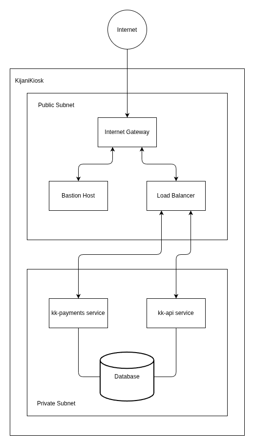

# Network Architecture

To secure the KijaniKiosk platform, we utilize a virtual network segmented into public and private subnets.

## Network Diagram

## Routing Logic and Segmentation
**Public Subnet** -> This subnet is assigned a route table that directs external traffic (0.0.0.0/0) to the Internet Gateway (IGW). Only resources that must be internet-facing, like the load balancer, reside here.
**Private Subnet** -> This subnet explicitly lacks a route to the Internet Gateway. Our core applications (`kk-api` and `kk-payments`) and databases are placed here. This strict routing logic ensures that no direct inbound traffic from the internet can reach our sensitive backend servers, severely limiting our attack surface.